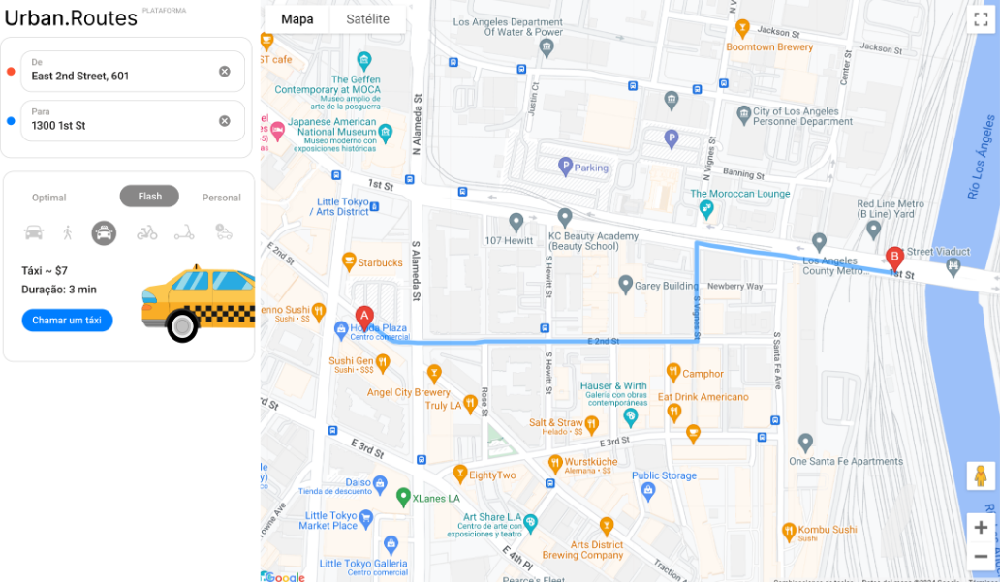
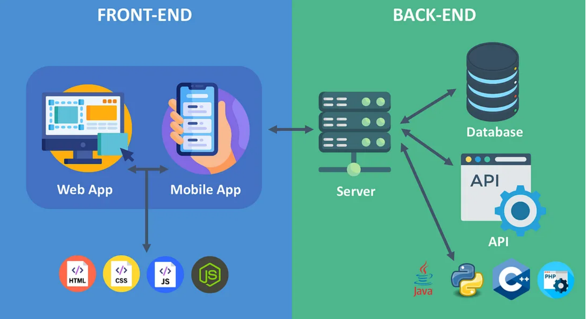
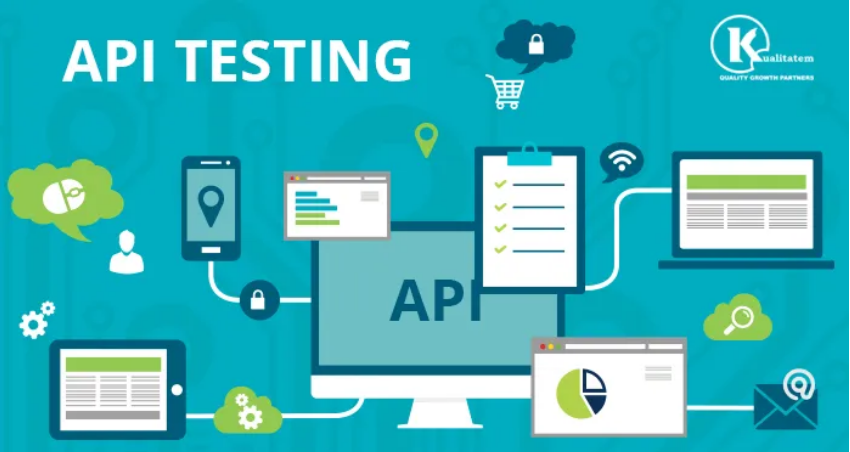
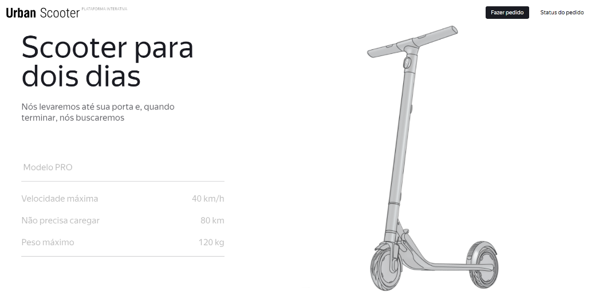

# Bootcamp QA - TripleTen

#### Sprint 1 - Teste de Regressão

A equipe de QA preparou os casos de teste para a execução do teste de regressão do Urban Routes. Seu objetivo é realizar esses testes e atribuir o status adequado a cada um. Como qualquer outro aplicativo, o Urban Routes pode apresentar falhas. Se nossos usuários tiverem uma experiência negativa, é provável que escrevam avaliações desfavoráveis e optem por utilizar outros aplicativos. Por isso, é fundamental identificar e relatar os bugs aos desenvolvedores o mais rapidamente possível para que possam ser corrigidos.

Responsabilidades e Habilidades Adquiridas:

- Desenvolvimento de testes
- Introdução a elaboração de Checklists
- Elaboração de relatório de bugs
- Criação de casos de teste
- Resultado esperado e Resultado real

Sprint 1 (Tópicos)

- O que são testes de software.
- Quais habilidades você precisa desenvolver para se tornar um analista de QA
- Como criar testes para um site
- O que fazer após encontrar um defeito

Informções Adicionais

O Urban Routes é um aplicativo que gera rotas e calcula o tempo e o custo das viagens para diferentes tipos de transporte.

A interface é bastante intuitiva, com dois campos para inserir os endereços de origem e destino: 'De' e 'Para'. O aplicativo oferece três modos de viagem — 'Ótimo', 'Rápido' e 'Personalizado' — além de ícones representando diferentes opções de transporte, como carro próprio, a pé, táxi, bicicleta, patinete, e caronas compartilhadas.

#### Sprint 2 - Design de Teste

Realizei meu primeiro teste de equivalência e de valores-limite, testando áreas dentro, fora e nos limites. Esses testes foram aplicados na funcionalidade de adicionar uma carteira de motorista ao aplicativo. Além disso, aprendi a utilizar mapas mentais e fluxogramas como auxílio visual para entender melhor o funcionamento completo dessa funcionalidade.

Tarefas aplicadas no projeto:

- Decompor e visualizar os requisitos com um mapa mental, um fluxograma e uma tabela.
- Definir os objetos de teste e projetar testes com a ajuda de técnicas de design de teste.
- Analisar os requisitos, encontrar áreas cinzentas e as especificar.
- Escrever casos de teste

Ferramenta utilizada:

- Draw.io

Experiência de aprendizado no Bootcamp

- Como são os requisitos de aplicativos e como os decompor
- Como mapas mentais e fluxogramas podem ajudar a visualizar esses requisitos
- O que são classes de equivalência e valores-limite e como usá-los para criar casos de teste

#### Sprint 3 - Teste de Aplicativos Web

Neste projeto, testei a funcionalidade de compartilhamento de carro em dois ambientes:

- Google Chrome, com resolução de tela 800x600
- Firefox, com resolução de tela 1920x1080

Além disso, desenvolvi novas abordagens de testes. Realizei meu primeiro teste de equivalência e de valores-limite, verificando áreas dentro, fora e nos limites da funcionalidade de adicionar uma carteira de motorista ao aplicativo. Também aprendi a utilizar mapas mentais como auxílio visual para compreender melhor o funcionamento completo dessa funcionalidade.

Ferramentas usadas:

- Figma
- Jira
- Excel

Experiência de aprendizado no Bootcamp:

- O que são arquitetura cliente-servidor, front-end e back-end 
- O que são URL, HTTP e HTTPS 
- Como visualizar solicitações e respostas HTTP no DevTools do navegador 
- O que são cookies, armazenamento local e cache

#### Sprint 4 - Teste de API - Urban Groucers

Neste projeto desenvolvi as seguintes tarefas:

- Criar e enviar solicitações à API via Postman
- Criar relatórios de bug
- Ler a documentação da API no Apidoc
- Criar os primeiros testes de API
- Testar a API através do Postman
- Enviar relatórios de bug ao Jira

Ferramentas usadas:

- Postman
- Jira
- Apidoc

Experiências de aprendizado no Bootcamp:

- O que é uma API
- Como a arquitetura de um aplicativo com uma API e banco de dados é organizada
- Como testar uma API
- O que é a solução de arquitetura REST

#### Sprint 5 - Noções básicas de banco de dados

Experiências adquiridas no Bootcamp:

- O que é uma linha de comando e como interagir com um computador através de comandos
- Como conectar a um servidor remoto via SSH
- O que é SQL e como você pode usá-lo para manipular dados
- Como juntar várias tabelas usando SQL

#### Projeto Final - Urban Scooter

O aplicativo Urban Scooter nos permite alugar uma scooter elétrica por até 7 dias. O serviço inclui a entrega e retirada da scooter na porta do cliente. Este projeto abrange a criação de uma interface funcional para o aluguel, com detalhes sobre o modelo PRO de scooter disponível.

Tarefas desenvolvidas no projeto:

- Estudar e decompor a documentação do aplicativo.
- Criar um mapa mental para visualizar os requisitos
- Dividir os recursos em blocos atômicos e definir objetos de teste.
- Fazer o design de testes para lidar com todos os requisitos.
- Aplicar classes de equivalência, valores-limite e uma tabela de decisão.
- Otimizar o número de testes nos testes de interface de usuário e testes lógicos dos recursos.
- Executar testes e realizar relatórios de bugs
- Usar o Postman para verificar solicitações para determinadas URLs.
- Verificar meu conhecimento sobre os principais aspectos de teste
- Analisar e fazer o design de testes; ou seja, testei aplicativos da web e APIs.
- Reportar e documentar no Jira os bugs que foram encontrados.

